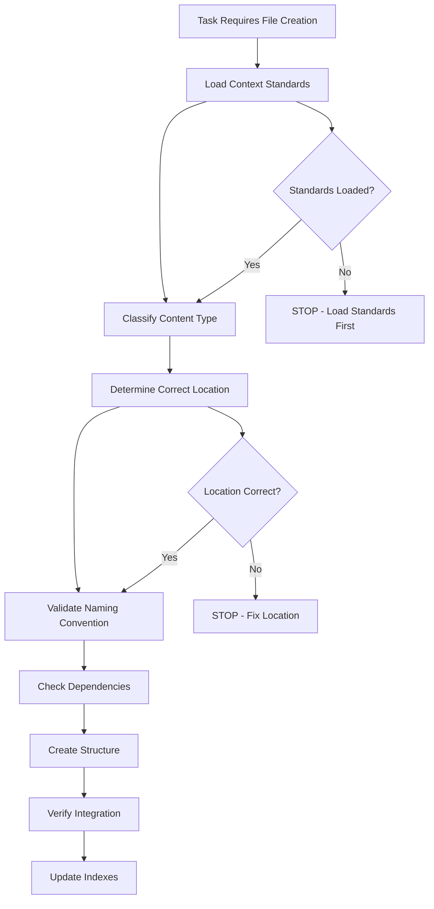

# Validation Checklist - Structure Creation Standards

## Overview

Systematic validation process to ensure all file/directory creation follows OpenCode standards and best practices.

---

## Pre-Creation Validation Protocol

### Phase 1: Context Loading (MANDATORY)
**BEFORE any file/directory creation, ALWAYS load:**

```markdown
Required Context Files:
□ ~/.opencode/context/core/system/context-guide.md
□ ~/.opencode/context/core/standards/patterns.md
□ ~/.opencode/context/index.md (for structure reference)
```

### Phase 2: Content Classification
**Classify each file/directory to be created:**

```markdown
Content Types:
□ Documentation (.md files) → ~/.opencode/context/
□ Executable scripts → ~/.opencode/bin/
□ Configuration templates → ~/.opencode/templates/
□ Agent definitions → ~/.opencode/agent/
□ Tools/plugins → ~/.opencode/tool/ or ~/.opencode/plugin/
□ Commands → ~/.opencode/command/
```

### Phase 3: Structure Validation
**Verify placement follows OpenCode hierarchy:**

```markdown
Structure Rules:
□ Scripts NEVER go in /context/ directories
□ Documentation NEVER goes in /bin/ directories
□ Executable files get proper permissions (chmod +x)
□ Context files are pure markdown (no executable code)
□ Follow existing patterns in target directory
```

### Phase 4: Naming Conventions
**Ensure consistent naming:**

```markdown
Naming Standards:
□ Context files: kebab-case.md (e.g., usage-guide.md)
□ Scripts: kebab-case without extension (e.g., n8n-test)
□ Directories: kebab-case (e.g., integrations/n8n/)
□ No spaces in file/directory names
□ Descriptive, not abbreviated names
```

### Phase 5: Dependencies Check
**Verify all dependencies are satisfied:**

```markdown
Dependencies:
□ Required parent directories exist
□ Referenced files/tools are available
□ Environment variables are documented
□ External dependencies are noted
```

## Validation Questions Checklist

### Before Creating ANY File/Directory:

1. **Purpose Classification**
   - [ ] What is this file's primary purpose?
   - [ ] Is it documentation, executable, configuration, or template?
   - [ ] Does it belong in context/, bin/, templates/, or other?

2. **Structure Compliance**
   - [ ] Have I loaded the context-guide.md?
   - [ ] Does this placement follow OpenCode patterns?
   - [ ] Am I mixing executable and documentation content?

3. **Naming Validation**
   - [ ] Does the name follow kebab-case convention?
   - [ ] Is the name descriptive and unambiguous?
   - [ ] Does it conflict with existing files?

4. **Content Separation**
   - [ ] Are scripts separate from documentation?
   - [ ] Are examples clearly marked as non-executable?
   - [ ] Is configuration separate from implementation?

5. **Integration Check**
   - [ ] Does this integrate properly with existing structure?
   - [ ] Are references and links correct?
   - [ ] Will this be discoverable via index files?

## Common Anti-Patterns to Avoid

### ❌ **NEVER DO:**
- Place executable scripts in `/context/` directories
- Mix documentation and executable code in same file
- Create files without checking existing structure
- Use spaces or special characters in names
- Skip loading context-guide.md before structural changes

### ✅ **ALWAYS DO:**
- Load validation context before creating structure
- Separate concerns (docs vs tools vs config)
- Follow established naming conventions
- Update index files when adding new content
- Test created structure for consistency

## Validation Workflow



## Emergency Stop Conditions

**IMMEDIATELY STOP and re-evaluate if:**
- Creating executable files in `/context/` directories
- Creating documentation in `/bin/` directories  
- Haven't loaded context-guide.md in current session
- Unsure about file placement or naming
- Mixing different content types in same location

## Post-Creation Validation

**After creating files/directories:**

```markdown
Final Checks:
□ Files are in correct locations per OpenCode standards
□ Permissions are set correctly (executable vs readable)
□ Index files are updated to reference new content
□ Documentation references are accurate
□ Structure follows established patterns
□ No anti-patterns were introduced
```

## Integration with Workflow

This validation checklist integrates with the main workflow at **Stage 3.1 (LoadContext)**:

```markdown
Enhanced Stage 3.1: LoadContext + Validation
1. Load required context files (existing)
2. Load validation checklist (NEW)
3. Apply validation protocol before any creation (NEW)
4. Proceed only after validation passes (NEW)
```

---

**Usage**: Load this checklist before any structural changes
**Reference**: `@~/.opencode/context/core/system/validation-checklist.md`
**Version**: 1.0
**Last Updated**: 2026-01-05